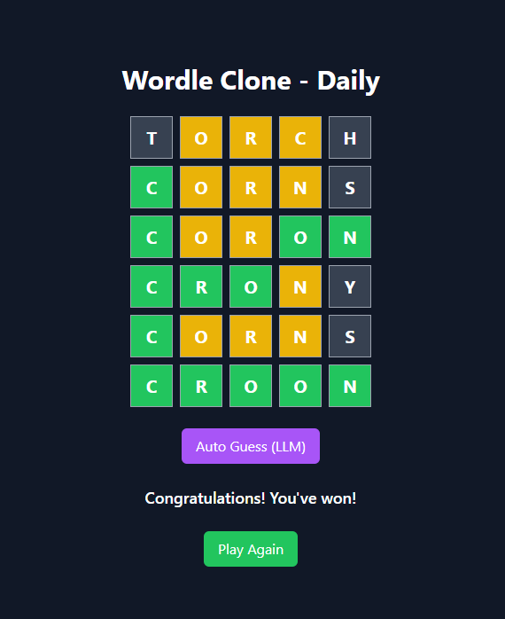

## Development

Run the dev server:

```shellscript
npm run dev
```

Install the local LLM Ollama https://ollama.com/
```shellscript
ollama pull llama3.2
ollama serve
```

## Deployment

First, build your app for production:

```sh
npm run build
```

Then run the app in production mode:

```sh
npm start
```



A Wordle Clone follows the same basic principles as the original Wordle game, with some potential variations. Here are the standard rules:

1. Objective
Guess the secret five-letter word in six attempts or fewer.

2. Gameplay Rules
Each guess must be a valid five-letter word.
After submitting a guess, the game provides feedback by coloring the letters:
Green 🟩: The letter is correct and in the correct position.
Yellow 🟨: The letter is in the word but in the wrong position.
Gray ⬜: The letter is not in the word at all.
You cannot guess random letter combinations; only actual words are allowed.
Players use the feedback to refine their guesses in subsequent attempts.
3. Winning & Losing
Win 🎉: If you guess the correct word within six attempts, you win.
Lose ❌: If you use all six attempts without finding the correct word, you lose, and the secret word is revealed.

